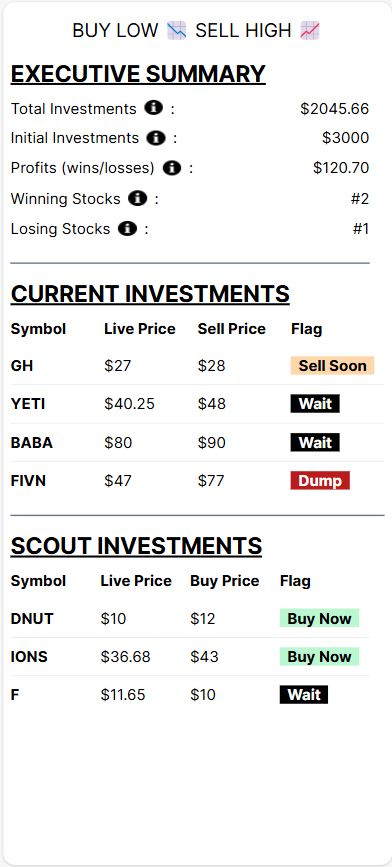

# Buy low 📉 Sell high 📈

Stock Investment planner based on my personal formula/strategy to validate the approach (number of winners vs losers, total money made/loss).

This project is under construction!!!!

[Click to view: Buy Low, Sell High](https://smileyinvestmentplanner.netlify.app/)

## Features
- TBD

## Built with
- **Next.js** is a frontend JavaScript framework, based on React but with server components/actions, used for displaying the user interface. 
- **TailwindCSS** is a CSS library utilized to quickly style the application. 
- **Jest** serves as a component testing framework. 
- **Netlify** is the hosting platform employed for hosting the application.
- **Intelligence Financial Modeling Prep** provided stock prices via an API. https://intelligence.financialmodelingprep.com/

## Get Started
1. Clone the repo
2. In the terminal for the stock-planner directory, type "npm install" to install the libraries.
3. Dummy data is already included to play with the app but  not access to the Stocks API.
4. In the terminal, type "npm run dev"

## Testing
### Getting Started with Testing
1. In a terminal, type "npm run test" to run the Jest test runner.  

## Author
- Website - [JC Smiley](https://www.jcsmileyjr.com)
- Twitter - [@JCSmiley4](https://twitter.com/JCSmiley4)
- LinkedIn - [jcsmileyjr](https://www.linkedin.com/in/jcsmileyjr/)
