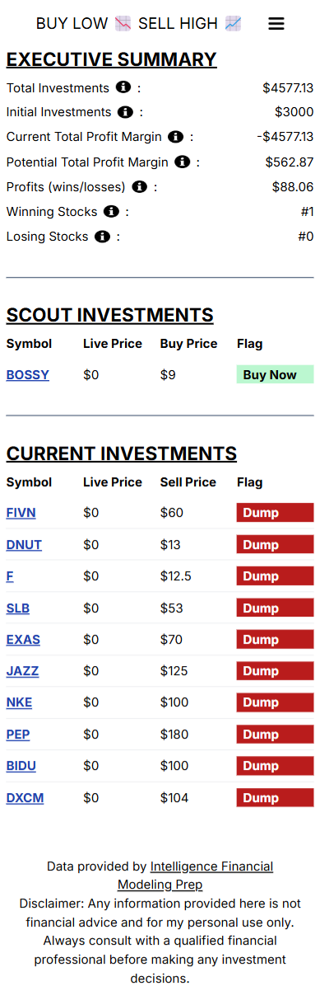

# Buy low 📉 Sell high 📈

Stock Investment planner based on my personal formula/strategy to validate the approach (number of winners vs losers, total money made/loss).

[Click to open the app: Buy Low, Sell High](https://smileyinvestmentplanner.netlify.app/)

[Read the blog post here](https://dev.to/jcsmileyjr/introducing-the-smiley-investment-planner-10-178j)

## Features
- Tagging system (flags) for each stock showing where they are on the journey. 
- Ability to track stock purchases/sales and allows users to input data like buying or selling prices for internal logic.
- Ability to designate a stock as a scout investment.
- A chart comparing potential profit margins from selling all stocks at optimal prices versus the current profit margins at today's prices.
- Executive summary section for a brief overview of progress.
- Can click on a stock title and be navigated to a fidelity.com information page about that stock

## Future updates
- Component testing with Jest and End to End testing with Cypress
- Additional charts summarizing the effectiveness of the strategy

## Built with
- **Next.js** is a frontend JavaScript framework, based on React but with server components/actions, used for displaying the user interface. 
- **TailwindCSS** is a CSS library utilized to quickly style the application. 
- **Jest** serves as a component testing framework. 
- **Netlify** is the hosting platform employed for hosting the application.
- **Intelligence Financial Modeling Prep** provided stock prices via an API. https://intelligence.financialmodelingprep.com/
- **Chartjs** is an open-source library that helps you easily visualize data using JavaScript. 
- **MongoDB** is an open-source NoSQL database management system (DBMS) that uses documents instead of tables and rows to store and process data. With this project, data is stored virtually using MongoDB Atlas and Mongoose ORM.

## Get Started
1. Clone the repo
2. In the terminal for the stock-planner directory, type "npm install" to install the libraries.
3. Dummy data is already included to play with the app but  not access to the Stocks API.
4. In the terminal, type "npm run dev"

## Testing
### Getting Started with Testing
1. In a terminal, type "npm run test" to run the Jest test runner.  

## Author
- Website - [JC Smiley](https://www.jcsmileyjr.com)
- Twitter - [@JCSmiley4](https://twitter.com/JCSmiley4)
- LinkedIn - [jcsmileyjr](https://www.linkedin.com/in/jcsmileyjr/)
